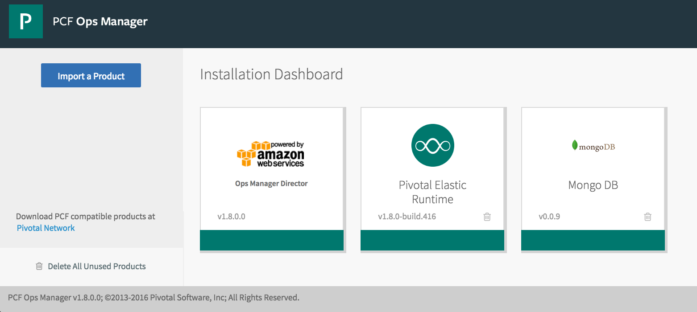

= MongoDB Service Broker for Pivotal Cloud Foundry

== Getting Started

. Install and run MongoDB somewhere accessable by Cloud Foundry

. Checkout the MongoDB service broker (this repo) from github
* *Option 1 (recommended):* 
+
Use Ops Manager to import the *.pivotal* artifact: _mongodb-broker/tile/product/mongo-db-for-pcf-0.0.10.pivotal_ 
+

* *Option 2 (advanced):* 
+
Build yourself: requires link:http://cf-platform-eng.github.io/isv-portal/tile-generator/[Tile Generator] installed
+
----
$ cd mongodb-broker/service-broker
$ mvn clean
$ mvn package
$ cd ../tile
$ tile build
----
+
Use Ops Manager to import the newly created *.pivotal* artifact: _mongodb-broker/tile/product/mongo-db-for-pcf-0.X.X.pivotal_

. Create security group needed by the tile config (you can override this if you wish by flipping the flag in tile.yml)
+
----
$ cf create-security-group all_open tile/release/src/templates/all_open.json
----

. Use OpsManager to configure and deploy the tile
+
image:docs/mongo_config.png[]

. Check the Marketplace in apps manager for developer access
+
image:docs/mongo_market.png[]

== Congratulations!

You have just deployed a custom service broker tile to auto-provision against an externally hosted MongoDB service!

