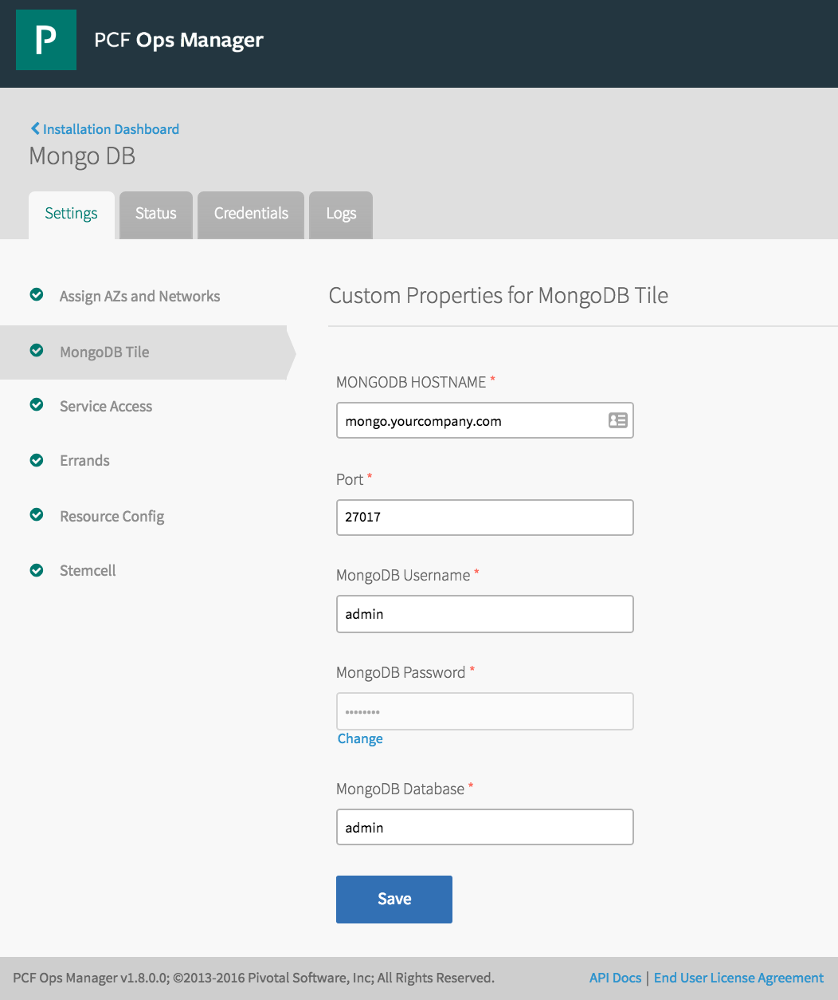
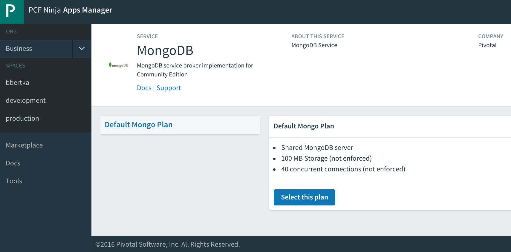

= MongoDB Service Broker for Pivotal Cloud Foundry 
Tested with MongoDB 2.6, and PCF 1.6.9+

== Getting Started
. Download the frodenas/mongodb Docker image
+
----
$ docker pull frodenas/mongodb:2.6
----

. Upload Docker-bosh release using link:https://bosh.io/docs/bosh-cli.html[Bosh CLI]
+
----
$ bosh target BOSH_HOST
$ cd docker-boshrelease
$ bosh upload release bosh upload release https://bosh.io/d/github.com/cf-platform-eng/docker-boshrelease
----

. Clone the MongoDB service broker (this repo) from github

. Build tile packages: requires link:http://cf-platform-eng.github.io/isv-portal/tile-generator/[Tile Generator] installed
+
----
$ cd mongodb-broker/service-broker
$ mvn clean
$ mvn package
$ cd ..
$ tile build
----

. Use Ops Manager to import the newly created *.pivotal* artifact
+
----
mongodb-broker/product/mongo-db-for-pcf-0.X.X.pivotal
----

. Create security group needed by the tile config (you can override this if you wish by flipping the flag in tile.yml)
+
----
$ cf create-security-group all_open release/src/templates/all_open.json
----

. Use OpsManager to configure and deploy the tile
+

. Check the Marketplace in apps manager for developer access
+

== Congratulations!

You can now auto-provision to a Docker backed MongoDB instance!

